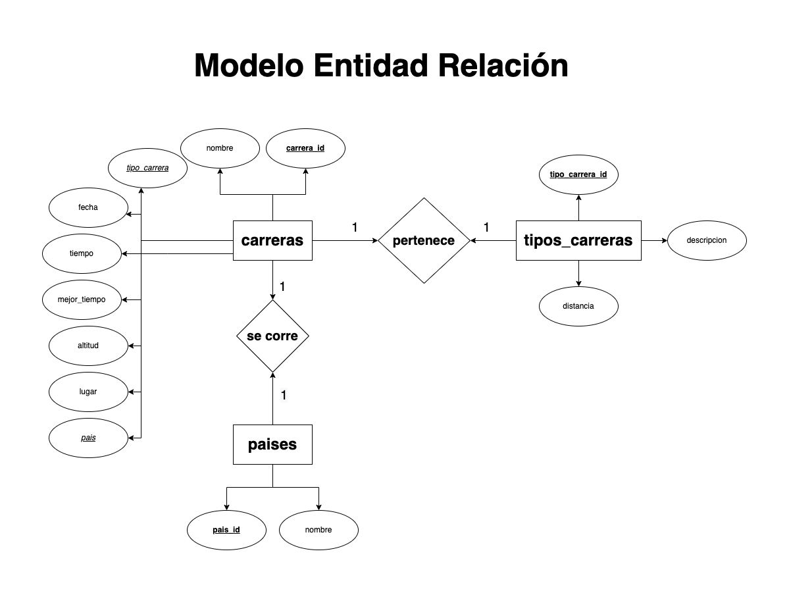

# Carreras

## Listado de Entidades

### carreras **(ED)**

- carrera_id **(PK)**
- nombre
- tipo_carrera **(FK)**
- fecha
- tiempo
- mejor_tiempo
- altitud
- lugar
- país **(FK)**
- foto

### tipos_carreras **(EC)**

- tipo_carrera_id **(PK)**
- descripcion
- distancia

### paises **(EC)**

- pais_id **(PK)**
- nombre

## Relaciones

1. Una **carrera** _pertenece_ a un **tipo de carrera** (_1 a M_).
1. Una **carrera** se _corre_ en un **país** (_1 a M_).

## Diagramas

### Modelo Entidad - Relación

### Modelo Relacional de la BD

