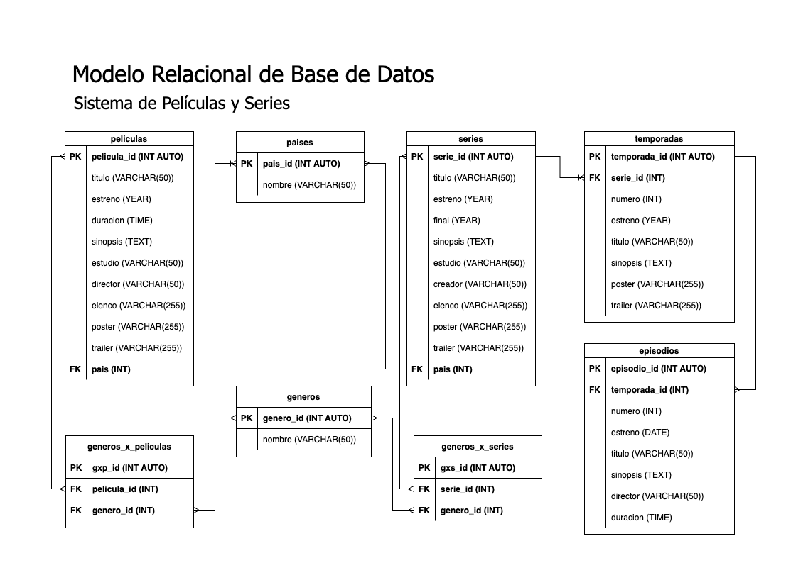

# PeliSeries

## Listado de Entidades

### peliculas **(ED)**

- pelicula_id **(PK)**
- titulo
- estreno
- duracion
- sinopsis
- estudio
- director
- elenco
- poster
- trailer
- pais **(FK)**

### series **(ED)**

- serie_id **(PK)**
- titulo
- estreno
- final
- sinopsis
- estudio
- creador
- elenco
- poster
- trailer
- pais **(FK)**

### temporadas **(ED)**

- temporada_id **(PK)**
- serie_id **(FK)**
- numero
- estreno
- titulo
- sinopsis
- poster
- trailer

### episodios **(ED)**

- episodio_id **(PK)**
- temporada_id **(FK)**
- numero
- estreno
- titulo
- sinopsis
- director
- duracion

### paises **(EC)**

- pais_id **(PK)**
- nombre

<!-- https://www.imdb.com/search/title/?genres -->

### generos **(EC)**

- genero_id **(PK)**
- nombre

### generos_x_peliculas **(EP)**

- gxp_id **(PK)**
- pelicula_id **(FK)**
- genero_id **(FK)**

### generos_x_series **(EP)**

- gxs_id **(PK)**
- serie_id **(FK)**
- genero_id **(FK)**

## Relaciones

1. Una **pelicula** tiene **país** (_1 - M_).
1. Una **serie** tiene **país** (_1 - M_).
1. Una **temporada** pertenece a **serie** (_1 - M_).
1. Un **episodio** pertenece a **temporada** (_1 - M_).
1. **Películas** pertenecen a **géneros** (_M - M_).
1. **Series** pertenecen a **géneros** (_M - M_).

## Diagramas

### Modelo Relacional de la BD

