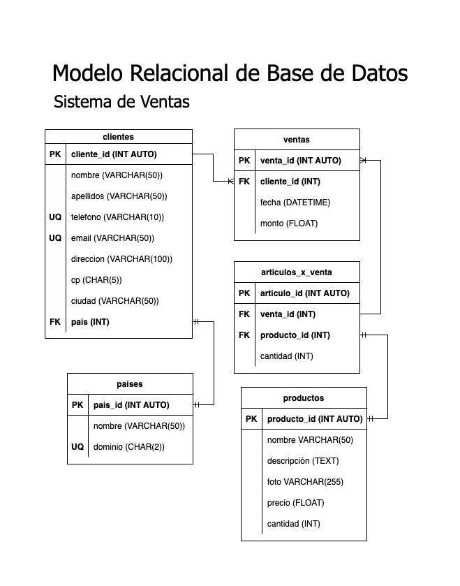

# Ventas

## Listado de Entidades

### clientes **(ED)**

- cliente_id **(PK)**
- nombre
- apellidos
- telefono **(UQ)**
- email **(UQ)**
- direccion
- cp
- ciudad
- pais **(FK)**

### productos **(ED|EC)**

- producto_id **(PK)**
- nombre
- descripcion
- foto
- precio
- cantidad

### ventas **(ED)**

- venta_id **(PK)**
- cliente_id **(FK)**
- fecha
- monto

### articulos_x_venta **(EP)**

- articulo_id **(PK)**
- venta_id **(FK)**
- producto_id **(FK)**
- cantidad

### paises **(EC)**

- pais_id **(PK)**
- nombre
- dominio **(UQ)**

## Relaciones

1. Un **cliente** tiene **país** (_1 - M_).
1. Un **cliente** genera **venta** (_1 - M_).
1. Una **venta** tiene **artículo** (_1 - M_).
1. Un **artículo** es un **producto** (_1 - 1_).

## Diagramas

### Modelo Relacional de la BD

